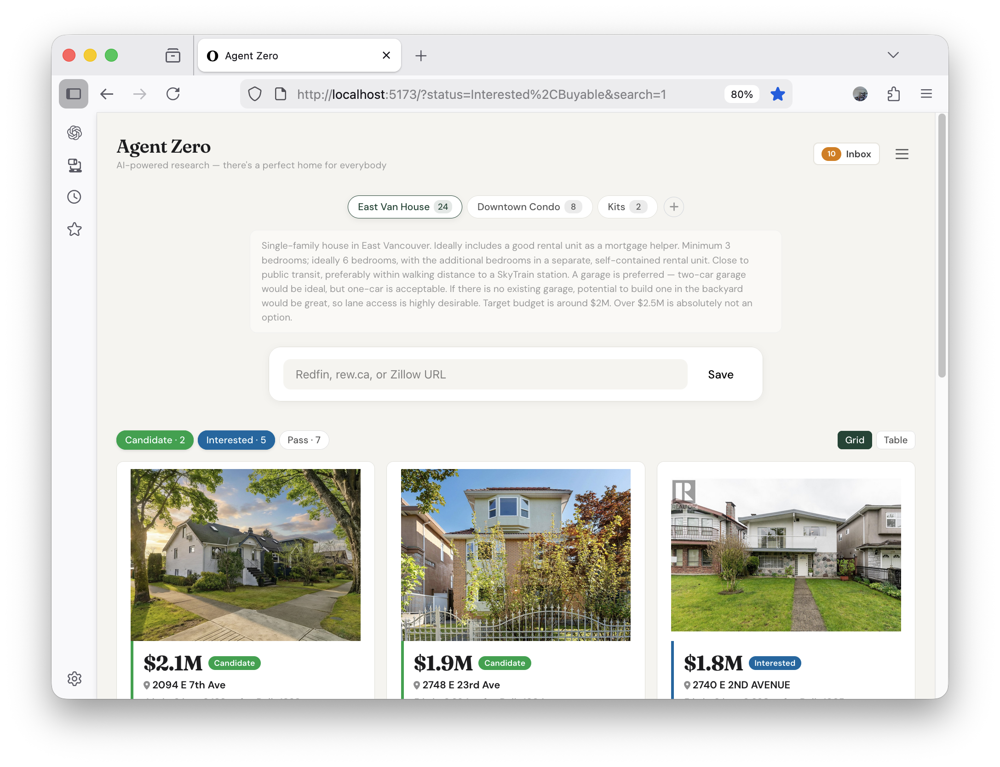
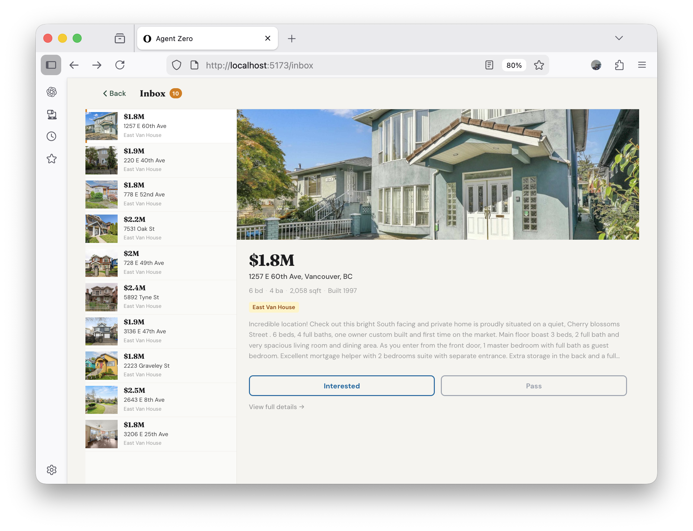
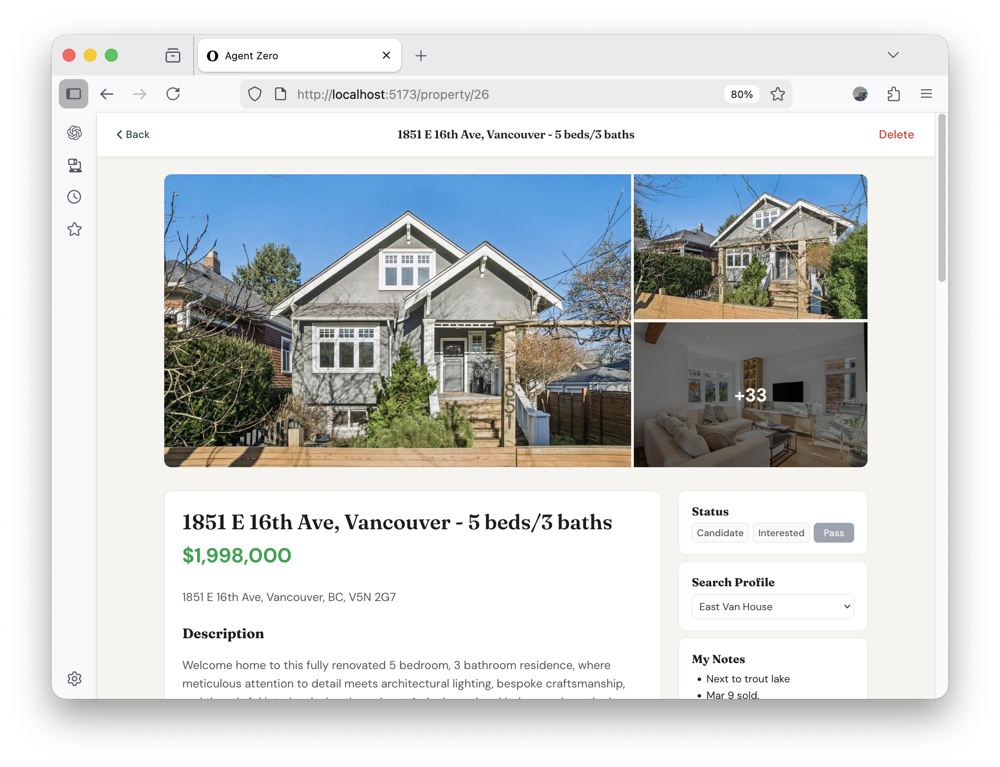

# AgentZero 🏠

> **Your personal AI real estate agent.**

Searching for a home is exciting. Scrolling through hundreds of listings every day is not.

Built to run with **[OpenClaw](https://openclaw.ai)**, AgentZero watches the market for you. Tell it what you're looking for, and it quietly surfaces only the homes worth your attention — no phone calls, no pressure, no awkward "I'll pass on this one" conversations.

## What It Does

- 📋 **Set your search profile** — location, price range, must-haves, described in plain language
- 🤖 **Let the agent do the watching** — AgentZero checks listings automatically on a schedule
- 📬 **Inbox new matches** — only the properties that fit, surfaced when they appear
- ✅ **Triage at your pace** — one-click Interested / Pass, no follow-up required
- 📸 **Full listing details** — photos, price history, notes, all in one place

No sign-ups. No subscriptions. Runs locally on your machine.

## Screenshots

Home screen shows you the properties that you are watching.

Daily agent curated listings in the inbox:

Details for listings you're interested in:

---

## Getting Started

1. Install [OpenClaw](https://openclaw.ai) — your local AI orchestrator
2. Ask your AI to **install AgentZero** and **set up a daily cron job**
3. On your favourite listing site (Redfin, Realtor.ca, or REW.ca), **set up a search and subscribe to new listing email alerts** — AgentZero will pick these up automatically
4. Open `http://localhost:5173` — your AI agent curates new listings daily for you to review

## Supported Sites

- ✅ Redfin
- ✅ REW.ca
- ✅ Realtor.ca
- 🚧 Zillow *(coming soon)*

---
