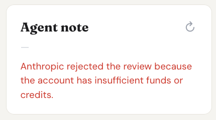

# How Agent Review Works

## Overview

Agent review is a background workflow used by `POST /api/listings/agent-suggest` and `POST /api/listings/:id/agent-review/run`.

The server does three separate things:

1. Save or load the listing.
2. Mark the review run as `Running` on the listing itself.
3. Spawn a background task that calls Claude and applies the decision.

The listing's user-facing status and the review task's execution state are intentionally different:

- `status` answers: what should happen to this listing in the product workflow?
- `agent_review_state` answers: what happened to the latest background review attempt?

## Review State Model

The persisted agent review fields live on the listing row:

- `agent_review_state`: `Running`, `Succeeded`, or `Failed`
- `agent_review_error_code`: stable machine-readable failure category
- `agent_review_error_message`: sanitized message safe to show in the UI
- `agent_review_started_at`: when the current or latest run started
- `agent_review_finished_at`: when the current or latest run finished

This is separate from the listing `status` field:

- `AgentPending` means the listing has not yet been approved or skipped by the agent.
- `HumanReview` means the agent approved it for human review.
- `AgentSkip` means the agent rejected it as a match.

A listing can therefore be:

- `status = AgentPending`
- `agent_review_state = Failed`

That combination means the workflow decision was never produced, and the UI should show the failure instead of pretending the request merely timed out.

## Request Flow

### `POST /api/listings/agent-suggest`

1. Parse and save the listing with `status = AgentPending`.
2. Mark `agent_review_state = Running`.
3. Spawn the background worker.
4. Return the saved listing immediately.

### `POST /api/listings/:id/agent-review/run`

1. Load the existing listing.
2. Mark `agent_review_state = Running` and clear any previous error.
3. Spawn the background worker.
4. Return `202 Accepted` immediately.

## Worker Outcomes

### Success

If Claude returns a valid decision:

1. The backend applies the decision through the normal agent-review write path.
2. The listing is updated with:
   - `status = HumanReview` or `AgentSkip`
   - `agent_review_comment = ...`
   - `agent_review_state = Succeeded`
   - cleared error fields
   - `agent_review_finished_at = now`

### Failure

If the worker fails before a decision is applied, it persists:

- `agent_review_state = Failed`
- `agent_review_error_code`
- `agent_review_error_message`
- `agent_review_finished_at = now`

Examples:

- invalid Anthropic API key
- insufficient Anthropic funds or credits
- rate limiting
- network failure talking to Claude
- malformed Claude response
- local failure saving the decision

### Example Failure UI

This is what a persisted billing failure looks like in the property detail page:

## Frontend Behavior

The property detail page does not infer success from `status` or `agent_review_comment`.
It polls the listing until `agent_review_state` becomes terminal:

- `Succeeded`: show the latest `agent_review_comment`
- `Failed`: show `agent_review_error_message`
- still `Running` after the poll budget: show a real "still running" message

This distinction matters because a fast authentication failure should surface immediately as an error.

## Why This Exists

Without persisted runtime state, async background work only has two visible outcomes:

- something changed
- nothing changed yet

That is not enough to distinguish between:

- a healthy long-running review
- a review that failed instantly
- a review that was never started

Persisting task outcome on the listing makes the API and UI honest about what actually happened.